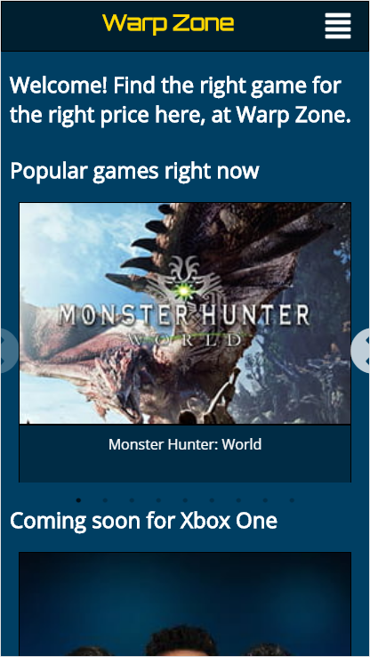

# Warp Zone

An application for users to research their next video game of interest along with their current sale prices.  

**The 3rd party API provided by IGDB.com has upgraded to V3.0. Please see the new Warp Zone GitHub at <https://github.com/avanichyanukroh/warp-zone-2.0>**

## Motivation

Tired of playing the same game or simply just looking for a great video game to gift? It's a lot of work to keep searching different sites to figure out which video game is the right one for you or the person you are buying it for. Sometimes after you find the right one, it was just simply out of your budget range. This gave me the idea to create a simple and effortless application that combines both aspects of video game and price comparison research.

## Screenshots

Registeration Page:

Login Page:

Landing Page:

Search Results Page:

Game Profile Page:

Game Profile Page (Price List Section):

User Profile Page:

Mobile Landing Page:

Mobile User Profile Page:

## Demo

username: gamer1
password: password

Log in with a preexisting demo account listed above to try out a personal profile account.

## Built With

* HTML
* CSS
* JavaScript
* React
* Redux
* Node.js
* Mlab
* Heroku

## Features

* Search video games by title.
* Popular games currently slider.
* Soon to release games slider (randomized platform).
* Price comparison section per game profile.
* Personal and customizable user profile.
* Add and delete games on/off wishlist.

## Future implementations

* Advance searches and filters (Search by genre, platform, developers).
* Personalized landing page based off user's genre preference and platform.
* Share and collaborate between users with personal profiles.
* Price watch list.
* Game release watch list.
* Game review section.
* Relevant news in landing page and game profile page.

## Author

* **Anawin Vanichyanukroh** - ** - Front-End Development, Back-End Development, Testing, Styling

## Acknowledgments

* **Jay Kumar** - ** - Mentor, Consultant
